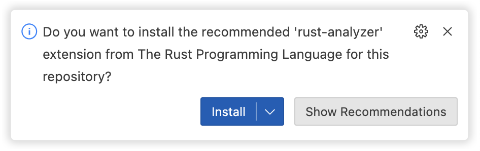
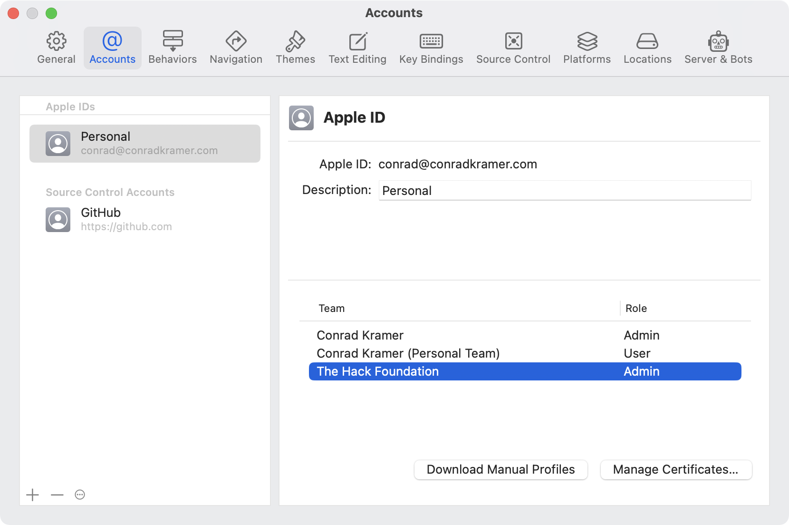

# Getting Started

## Dependencies

Before you can start working on Burrow, you'll need to install some dependencies. They are different for each platform:

<details>
  <summary>Linux</summary>

1. Install **rustup** using the instructions on the [website](https://rustup.rs/):

```bash
$ curl --proto '=https' --tlsv1.2 -sSf https://sh.rustup.rs | sh
```

2. Install **Visual Studio Code** from the [website](https://code.visualstudio.com/#alt-downloads), [Snap Store](https://snapcraft.io/code), or your package manager of choice.
</details>

<details>
  <summary>macOS</summary>

1. Install **rustup** using the instructions on the [website](https://rustup.rs/):

```bash
$ curl --proto '=https' --tlsv1.2 -sSf https://sh.rustup.rs | sh
```

2. Download and install **Visual Studio Code** from the [website](https://code.visualstudio.com/#alt-downloads), or by using brew:

```
brew install --cask visual-studio-code
```

3. Download and Install **Xcode** from the [App Store](https://apps.apple.com/us/app/xcode/id497799835) or the [Apple Developer](https://developer.apple.com/downloads) website.

4. Make sure the _"current"_ version of Xcode matches the one you are using:

```
$ xcode-select -p
```

If the output is not the version of Xcode you just installed, run the following command to switch to the new version:

```
$ sudo xcode-select -s {PATH_TO_XCODE}
```

</details>

<details>
  <summary>Windows</summary>

1. Download **Visual Studio** community edition from the [website](https://visualstudio.microsoft.com/vs/). Install the components for "Desktop Development with C++"

2. Install [**Visual Studio Code**](https://apps.microsoft.com/store/detail/visual-studio-code/XP9KHM4BK9FZ7Q), [**PowerShell**](https://apps.microsoft.com/store/detail/powershell/9MZ1SNWT0N5D) and [**Windows Terminal**](https://apps.microsoft.com/store/detail/windows-terminal/9N0DX20HK701) from the Microsoft Store

3. Open Windows Terminal and use [winget](https://learn.microsoft.com/en-us/windows/package-manager/winget/) to install **git**, **LLVM** and **rustup**:

```posh
winget install Git.Git
winget install LLVM.LLVM
winget install Rustlang.Rustup
```

4. Install Rust using rustup:

```posh
rustup toolchain install stable-msvc
```

</details>

## Building

1. Clone the repository:

```
git clone git@github.com:hackclub/burrow.git
```

2. Open the `burrow` folder in Visual Studio Code:

```
code burrow
```

3. Install the Visual Studio Code extensions [**rust-analyzer**](https://marketplace.visualstudio.com/items?itemName=rust-lang.rust-analyzer) and [**CodeLLDB**](https://marketplace.visualstudio.com/items?itemName=vadimcn.vscode-lldb). You should get a suggestion to do this automatically:

</img>

4. Compile burrow in Visual Studio Code by selecting `Terminal -> Run Build Task`

## Running

<details>
  <summary><b>Command Line</b></summary>

You can run burrow on the command line with cargo:

```
cargo run
```

Cargo will ask for your password because burrow needs permission in order to create a tunnel.

</details>

<details>
  <summary><b>Visual Studio Code</b></summary>

You can debug the Rust program inside of Visual Studio using the **Run and Debug** tab.

**_This does not work fully yet_**. Visual Studio Code does not have a way to debug programs with administrative privileges.

</details>

<details>
  <summary><b>iOS or macOS</b></summary>

You can run the Burrow app on iOS or macOS using **Xcode**.

You will need to be logged in with your Apple ID, and it should be a part of **The Hack Foundation** team:

</img>

If your Apple ID is not a part of The Hack Foundation team, ask the Slack channel for assistance.

You should now be able to run the app by opening `Apple/Burrow.xcodeproj` in Xcode, selecting the **App** scheme and clicking **Run**.

</details>
